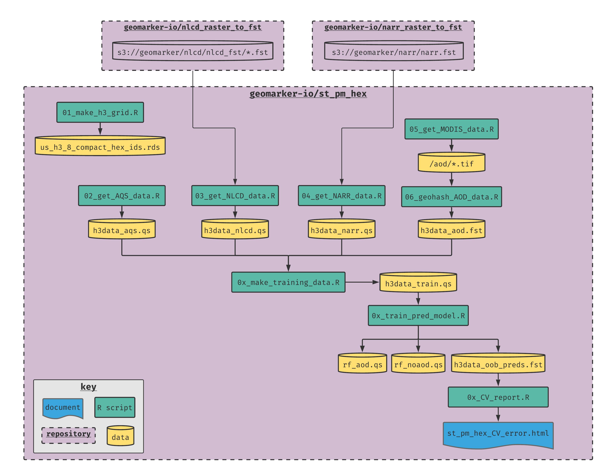

# st_pm_hex

> a spatiotemporal PM2.5 exposure assessment model for the contiguous US

## computational workflow



## using `renv` for package management

- `renv` should be installed and activated automatically if starting R from the project root working directory
- run `renv::snapshot()` to add packages contained within the code to the library (make sure to commit the `renv` project infrastructure, like the `renv.lock` file to the github repository)
- after pulling this project from GitHub, run `renv::restore()` to synchronize the library with the lockfile
- see more info here: https://rstudio.github.io/renv/

### `h3` package

The `h3` package might not install properly using "normal" installation code for packages on GitHub because it requires installation of the h3 library ahead of time.  See full instructions here: https://github.com/crazycapivara/h3-r

- install h3 library on macOS with:
```
brew install h3
```

- install h3 library on debian/ubuntu with:
```
git clone https://github.com/uber/h3.git h3c
cd h3c
git pull origin master --tags
git checkout "v3.3.0"
cmake -DENABLE_FORMAT=OFF -DBUILD_SHARED_LIBS=ON .
sudo make install
cd ..
rm -rf h3c
```

## storing and retrieving data on AWS S3

- the aws cli must be installed and you must have proper permissions with `AWS_SECRET_ACCESS_KEY` and `AWS_ACCESS_KEY_ID` environment variables set
- storing data
    - sync the local working directory with a S3 directory with `aws s3 sync . s3://path/to/remote/folder`
    - for example sync clean AOD rasters with `aws s3 sync ./aod_clean_rasters s3://geomarker/aod`
- retrieving data
    - `aws s3 sync s3://geomarker/aod ./aod_clean_rasters`

## 1. make h3 grid

- use the [H3 hexagonal hierarchical spatial index](https://eng.uber.com/h3/) to create the grid at a precision of 8
    - average area = 0.74 sq km
    - average side length = 461.4 m
    - n unique in continental US = 11,932,970
    - for comparison, the actual resolution of the modis grid is 926 by 926 m = 0.86 sq km
    - see the [example cincinnati map](h3_cincy_example_map.html) for an example of the hierarchical h3 layout
- geohash
    - each hash is made up of 15 total characters, with the first character always being an `8`, the second character denoting the resolution and the remaining 13 being a combination of the geohash itself and "filler" f's
    - values can be `0`, `1`, `2`, `3`, `4`, `5`, `6`, `7`, `8`, `9`, `a`, `b`, `c`, `d`, `e`, `f`
    - for example, a geohash at a resolution of 6 would be `86______fffffff` where the `______` is the six digit geohash
    - overall, resolution ranges from 0 - 15
- see [h3 docs](https://h3geo.org/#/documentation/overview/use-cases) for more information on use cases and "why hexagons?"
- table describing H3 properties at different resolutions

   | res | n digits | code | avg area (sq km) | n unique in cont US |
   |-----|----------|------|------------------|---------------------|
   | 0   | 2        | `80` | 4,250,546        |                     |
   | 1   | 3        | `81` | 607,220          |                     |
   | 2   | 4        | `82` | 86,745           | 81                  |
   | 3   | 4        | `83` | 12,392           |                     |
   | 4   | 5        | `84` | 1,770            | 4,970               |
   | 5   | 6        | `85` | 252              |                     |
   | 6   | 6        | `86` | 36               | 139,160             |
   | 7   | 7        | `87` | 5                |                     |
   | 8   | 8        | `88` | 0.74             | 11,932,970          |
   | 9   | 9        | `89` | 0.11             |                     |
   | 10  | 10       | `8a` | 0.02             |                     |
    
- using the compact US h3 hex ids (saved locally as `us_h3_8_compact_hex_ids.rds`), takes up much less space and can be quickly down scaled to the desired resolution for different geospatial calculations; e.g.,

```r
d_hex <- readRDS('us_h3_8_compact_hex_ids.rds') %>%
  map(h3_to_children, res = 8) %>%
  unlist()
```

- these can then be translated into a simple features object with

```r
## points:
d <-
  bind_cols(tibble(h3 = d_hex),
            as_tibble(h3::h3_to_geo(d_hex))) %>%
  st_as_sf(coords = c('lng', 'lat'), crs = 4326)

## polygons:
d <-
  bind_cols(tibble(h3 = d_hex),
            as_tibble(h3::h3_to_geo_boundary_sf(d_hex)))
```

**be warned that `h3::geo_to_h3()` will give an incorrect geohash without warning or error if the `sf` object is not lat/lon (i.e. any epsg other than 4326)**

## 2. get AQS data

- average by date for co-located stations (5,261,947 total rows, but only 3,456,471 total unique station/lat/lon/date combinations)
- subset to only the contiguous united states using intersection in EPSG 5072 (n = 3,346,280)
- create "nearby pm2.5" column (`nearby_pm`) as median of medians of yesterday, today, and tomorrow for each "res 5" h3 region
- data saved as `s3://geomarker/st_pm_hex/h3data_aqs.qs`

## 3. get NLCD data

- National Land Cover Database information is taken from the [geomarker-io/addNlcdData](https://github.com/geomarker-io/addNlcdData) R package that uses `.fst` files to speed up extraction and summary for polygons
- training data only saved as `s3://geomarker/st_pm_hex/h3data_nlcd.qs`

## 4. get NARR data

- [NARR](https://www.esrl.noaa.gov/psd/data/gridded/data.narr.html) data details
- [geomarker-io/nlcd_raster_to_fst](https://github.com/geomarker-io/nlcd_raster_to_fst) repository that uses a `.fst` file to speed up extraction for points is used, although the code here is specialized for the hexagon centroids
- training data only saved as `s3://geomarker/st_pm_hex/h3data_narr.qs`

## 5. get MODIS data

- [MCD19A2: MODIS/Terra and Aqua MAIAC Land AOD Daily L2G 1km SIN Grid V006](https://lpdaac.usgs.gov/products/mcd19a2v006/)
- [MCD19A2 User Guide](https://lpdaac.usgs.gov/documents/110/MCD19_User_Guide_V6.pdf)
- cleaned AOD rasters are stored at [s3://geomarker/aod/](https://geomarker.s3.us-east-2.amazonaws.com/aod)

### Running To Get All Clean Rasters

- repetitively run the script until all rasters are on disk
- getting a cleaned AOD raster often fails because of download failure
- sometimes, none of the desired tiles are available for download at all or all of the downloaded tiles don't have any quality, non-missing AOD measurements
- in these cases, the script will make a "dummy" file so that the date will be marked as "completed"

For example, create a wrapper bash script to run the script every minute if it isn't already running:

- create `run_it.sh`:

```sh
#!/bin/bash

cd /home/cole/st_pm_hex
rm qa_MCD19A2.A*
rm MCD19A2.A*
rm aod_MCD19A2.A*
/usr/bin/Rscript ./04_get_modis_data.R
```

- then setup a cron job (`crontab -e`) to run every minute if it isn't already running:

```sh
*/1 * * * * /usr/bin/flock -n /tmp/fcj.lockfile /home/cole/st_pm_hex/run_it.sh
```

- check how many dates are completed with `ll aod_clean_rasters/ | wc -l`
- sync to S3 drive with `aws s3 sync ./aod_clean_rasters s3://geomarker/aod`


## 6. geohash AOD data

- use `06_make_AOD_data.R` to extract all non-missing AOD data from folder of rasters as a data.table fst file keyed on h3 and date
- `h3data_aod.fst` (saved as `s3://geomarker/st_pm_hex/aod.fst`) takes up 6.9 GB in RAM and 1.1 GB on disk

## 7. get NEI data

- [NEI](https://www.epa.gov/air-emissions-inventories/national-emissions-inventory-nei) is the National Emissions Inventory Database
  - data available in 2008, 2011, 2014, 2017
- [scc](https://ofmpub.epa.gov/sccwebservices/sccsearch/) is a code which defines the type of emissions
- EIS is grouping of SCC codes into: point, nonpoint, onroad, nonroad, and event sources
- script will output `nei_county_pm25.rds`  and `nei_point_pm25.rds` files (saved as `s3://geomarker/nei/nei_county_pm25.rds` and `s3://geomarker/nei/nei_point_pm25.rds`)
- county file contains the estimated tons of pm2.5 emitted, as columns called `nonroad`, `onroad`, `nonpoint`, and `event`, for each `fips` and each `nei_year` (2008, 2011, 2014, or 2017)
    - event data is not available for 2008
    - at the time, nonpoint, and onroad data was not yet available for 2017
    - all other counties not listed for any given nei year were set to zero
- point file contains sf object with `h3` geohash, and `total_emissions` for each `nei_year` (all `eis` codes are equal to "point" for this file)

## 8. get FINN data

- [FINN](https://www2.acom.ucar.edu/modeling/finn-fire-inventory-ncar) is the Fire Emissions from NCAR database
  - https://doi.org/10.5194/gmd-4-625-2011
  - FINN v1.5 files avail daily at 1km resolution from 2002 to 2018
- script will output combined data in `s3://geomarker/st_pm_hex/h3data_finn.fst`, with columns for `date`, `area` (burned area), `h3`, and `fire_pm25` (estimated total pm25 emitted from fire)
- file is 98 MB on disk

## 9. get population density

- uses 2018 5-yr ACS census-tract level estimates of total population (`B01001_001`) to estimate total population for each *resolution 5* h3 cell using an area-weighted approach; population density is calculated as number of total population divided by area of each resolution 5 h3 cell in epsg:5072

## 10. make training data

- merge in all columns based on pm2.5 observations
- retain `h3` for grid cell identifier
- add in county fips for each geohash for merging NEI data
- include x and y coordinates (in epsg 5072) for geohashes
- create year, day of year, and day of week columns
- add indicator variable for major US holidays (new years, 4th july, TG, xmas, MLK, memorial)
- merge in NARR data based on h3 and date
- merge in annual data to closest available calendar year (NEI and NLCD)
- add distance to closest NEI site for each grid centroid (merge year by nei_year)
- add in population density based on res-5 h3
- add distance to closest 2018 S1100 road for each grid centroid
- merge in aod data (set all AOD > 2 to `NA`, n = 150)
- merge in fire data
- total of 3,345,299 observations and 43 predictors
- file saved as `s3://geomarker/st_pm_hex/h3data_train.fst` (1.14 GB in RAM, 127 MB on disk)
- 10,084 (0.3%) of grid-days with pm25 had non-missing aod data

| database | variable         | units         | space             | time                            | note                                                       |
|----------|------------------|---------------|-------------------|---------------------------------|------------------------------------------------------------|
| AQS      |                  |               | exact             | daily                           |                                                            |
|          | pm25             | ug/m3         | h3                |                                 | geohash                                                    |
|          | nearby_pm        | ug/m3         | "res 5" h3 region |                                 | median of medians of yesterday, today, and tomorrow        |
| MRLC     |                  |               | 30 x 30 m         | annual (2001, 2006, 2011, 2016) | fraction TRUE inside h3 polygon, joined to nearest year    |
|          | impervious       | mean fraction | h3                |                                 | mean of all fractional continuous values inside h3 polygon |
|          | green            | fraction      | h3                |                                 | custom green definition based on nlcd categorization       |
|          | primary_urban    | fraction      | h3                |                                 |                                                            |
|          | primary_rural    | fraction      | h3                |                                 |                                                            |
|          | secondary_urban  | fraction      | h3                |                                 |                                                            |
|          | secondary_rural  | fraction      | h3                |                                 |                                                            |
|          | tertiary_urban   | fraction      | h3                |                                 |                                                            |
|          | tertiary_rural   | fraction      | h3                |                                 |                                                            |
|          | thinned_urban    | fraction      | h3                |                                 |                                                            |
|          | thinned_rural    | fraction      | h3                |                                 |                                                            |
|          | nonroad_urban    | fraction      | h3                |                                 |                                                            |
|          | nonroad_rural    | fraction      | h3                |                                 |                                                            |
|          | energyprod_urban | fraction      | h3                |                                 |                                                            |
|          | energyprod_rural | fraction      | h3                |                                 |                                                            |
|          | nonimpervious    | fraction      | h3                |                                 | anything without an impervious classification              |
| NARR     |                  |               | 0.3°×0.3°         | daily                           | value at h3 centroid                                       |
| MODIS    |                  |               | ~ 926 x 926 m     |                                 |                                                            |
|          | aod              | unitless      | h3                | daily                           | convert raster cells to lat/lon points and geohash         |
| NEI      |                  |               |                   | annual (2008, 2011, 2014, 2017) | joined to nearest year                                     |
| FINN     |                  |               |                   |                                 |                                                            |
| TIGER    | dist_to_s1100    |               | exact             | static (2018)                   | distance to h3 centroid                                    |
| derived  | year             |               |                   |                                 | integer                                                    |
|          | day of year      |               |                   |                                 | integer                                                    |
|          | day of week      |               |                   |                                 | categorical                                                |
|          | holiday          |               |                   |                                 |                                                          |
|          | X coord          |               |                   |                                 | numeric (epsg 5072)                                        |
|          | Y coord          |               |                   |                                 | numeric (epsg 5072)                                        |
|          | h3               |               |                   |                                 | categorical (grid indicator)                               |

### missing data

- `nei_nonroad`, `nei_onroad`, `nei_nonpoint`, and `nei_event` values could be missing for earlier years
- `aod` is missing in most places
- will not be imputed because grf handles them by using them in splits (just like we did for cincy aod model, but automatically)
- https://grf-labs.github.io/grf/REFERENCE.html#missing-values
- this will also allow for missing variables for new predictions

## 11. train pred model

- use GRF with and without cluster set to h3 identifier
- create OOB predictions using predict without new obs and predict with new obs of same training set

## 12. cv error report

- creates figures and tables for quantifying CV error in `./cv_output/` folder

- Brokamp, 2020: LLO CV R2 = XXX
- Brokamp, 2018: LOOCV R2 = 0.91
- Hu, 2017: 10-fold CV R2 = 0.84
- QD, 2016: 10-fold CV R2 = 0.80

## 13. create Safe Harbor aggregated h3 cells

**add in results on population distribution and number of merged cells here**

## 14. predicting for all h3-dates

- function to predict days for one chunk of h3 grids for one year: `predict_pm_h3_5_year()`
    - takes in `h3_5` and `year`
    - outputs `{h3_5}_{year}.fst` with columns for date, h3, pm, pm_se
- grab read in stuff from schwartz geohash model
    
