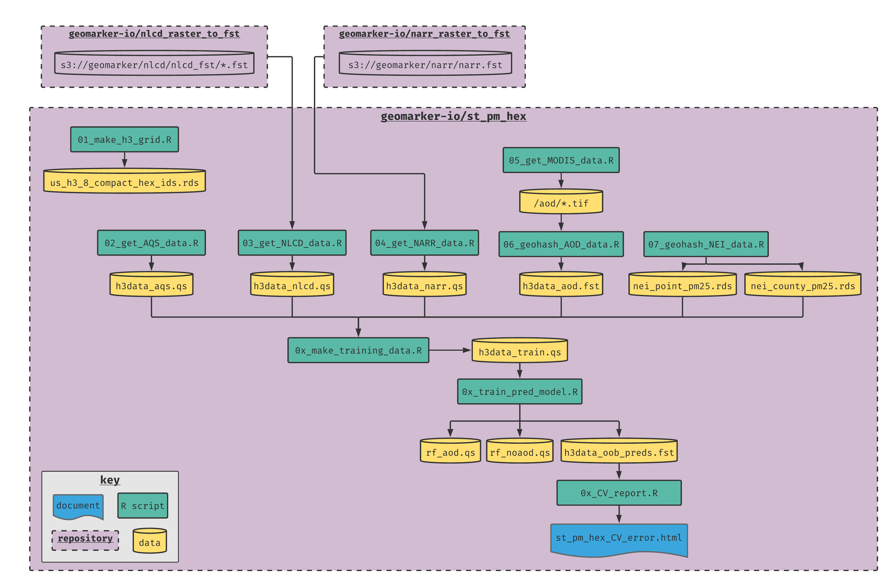

# st_pm_hex

> a spatiotemporal PM2.5 exposure assessment model for the contiguous US

## computational workflow



## using `renv` for package management

- `renv` should be installed and activated automatically if starting R from the project root working directory
- run `renv::snapshot()` to add packages contained within the code to the library (make sure to commit the `renv` project infrastructure, like the `renv.lock` file to the github repository)
- after pulling this project from GitHub, run `renv::restore()` to synchronize the library with the lockfile
- see more info here: https://rstudio.github.io/renv/

### `h3` package

The `h3` package might not install properly using "normal" installation code for packages on GitHub because it requires installation of the h3 library ahead of time.  See full instructions here: https://github.com/crazycapivara/h3-r

- install h3 library on macOS with:
```
brew install h3
```

- install h3 library on debian/ubuntu with:
```
git clone https://github.com/uber/h3.git h3c
cd h3c
git pull origin master --tags
git checkout "v3.3.0"
cmake -DENABLE_FORMAT=OFF -DBUILD_SHARED_LIBS=ON .
sudo make install
cd ..
rm -rf h3c
```

## storing and retrieving data on AWS S3

- the aws cli must be installed and you must have proper permissions with `AWS_SECRET_ACCESS_KEY` and `AWS_ACCESS_KEY_ID` environment variables set
- storing data
    - sync the local working directory with a S3 directory with `aws s3 sync . s3://path/to/remote/folder`
    - for example sync clean AOD rasters with `aws s3 sync ./aod_clean_rasters s3://geomarker/aod`
- retrieving data
    - `aws s3 sync s3://geomarker/aod ./aod_clean_rasters`

## 1. make h3 grid

- use the [H3 hexagonal hierarchical spatial index](https://eng.uber.com/h3/) to create the grid
    - average area of an h3 hexagon at a precision of 8 is 0.74 sq km
    - average length of an h3 hexagon side at a precision of 8 is 0.4614 km
    - actual resolution of modis grid is 926 by 926 m = 0.86 sq km
    - there are 11,932,970 unique valid H3 indexes at this resolution that we use to cover the contiguous US
    - each hash is made up of 15 total characters; for the precision of 8, the first characteristics 10 are used and the last 5 are "filler" f's (values can be 0, 1, 2, 3, 4, 5, 6, 7, 8, 9, a, b, c, d, e, f)
- see the [example cincinnati map](h3_cincy_example_map.html) for an example of the hierarchical h3 layout
- using the compact US h3 hex ids (saved locally as `us_h3_8_compact_hex_ids.rds`), takes up much less space and can be quickly down scaled to the desired resolution for different geospatial calculations; e.g.,

```r
d_hex <- readRDS('us_h3_8_compact_hex_ids.rds') %>%
  map(h3_to_children, res = 8) %>%
  unlist()
```

- these can then be translated into a simple features object with

```r
## points:
d <-
  bind_cols(tibble(h3 = d_hex),
            as_tibble(h3::h3_to_geo(d_hex))) %>%
  st_as_sf(coords = c('lng', 'lat'), crs = 4326)

## polygons:
d <-
  bind_cols(tibble(h3 = d_hex),
            as_tibble(h3::h3_to_geo_boundary_sf(d_hex)))
```

## 2. get AQS data

- average by date for co-located stations (5,032,639 total rows, but only 3,347,073 total unique station/lat/lon/date combinations)
- training only data saved `s3://geomarker/st_pm_hex/h3data_aqs.qs`
- this also serves as the dataset tracking which h3-date combinations are needed for the training dataset

- TODO subset to contiguous united states (this is already done for AOD, but won't be if we use all aqs data as training points...)

## 3. get NLCD data

- National Land Cover Database information is taken from the [geomarker-io/nlcd_raster_to_fst](https://github.com/geomarker-io/nlcd_raster_to_fst) repository that uses `.fst` files to speed up extraction and summary for polygons
- the functions to extract from fst files are replicated locally from that repository, although the code here is specialized for the hexagon cells
- training data only saved as `s3://geomarker/st_pm_hex/h3data_nlcd.qs`

## 4. get NARR data

- [NARR](https://www.esrl.noaa.gov/psd/data/gridded/data.narr.html) data details
- [geomarker-io/nlcd_raster_to_fst](https://github.com/geomarker-io/nlcd_raster_to_fst) repository that uses a `.fst` file to speed up extraction for points is used, although the code here is specialized for the hexagon centroids
- training data only saved as `s3://geomarker/st_pm_hex/h3data_narr.qs`

## 5. get MODIS data

- [MCD19A2: MODIS/Terra and Aqua MAIAC Land AOD Daily L2G 1km SIN Grid V006](https://lpdaac.usgs.gov/products/mcd19a2v006/)
- [MCD19A2 User Guide](https://lpdaac.usgs.gov/documents/110/MCD19_User_Guide_V6.pdf)
- cleaned AOD rasters are stored at [s3://geomarker/aod/](https://geomarker.s3.us-east-2.amazonaws.com/aod)

### Running To Get All Clean Rasters

- repetitively run the script until all rasters are on disk
- getting a cleaned AOD raster often fails because of download failure
- sometimes, none of the desired tiles are available for download at all or all of the downloaded tiles don't have any quality, non-missing AOD measurements
- in these cases, the script will make a "dummy" file so that the date will be marked as "completed"

For example, create a wrapper bash script to run the script every minute if it isn't already running:

- create `run_it.sh`:

```sh
#!/bin/bash

cd /home/cole/st_pm_hex
rm qa_MCD19A2.A*
rm MCD19A2.A*
rm aod_MCD19A2.A*
/usr/bin/Rscript ./04_get_modis_data.R
```

- then setup a cron job (`crontab -e`) to run every minute if it isn't already running:

```sh
*/1 * * * * /usr/bin/flock -n /tmp/fcj.lockfile /home/cole/st_pm_hex/run_it.sh
```

- check how many dates are completed with `ll aod_clean_rasters/ | wc -l`
- sync to S3 drive with `aws s3 sync ./aod_clean_rasters s3://geomarker/aod`


## 6. geohash AOD data

- use `06_make_AOD_data.R` to extract all non-missing AOD data from folder of rasters as a data.table fst file keyed on h3 and date
- `h3data_aod.fst` (saved as `s3://geomarker/st_pm_hex/aod.fst`) takes up 6.9 GB in RAM and 1.1 GB on disk

## 7. get NEI data

- [NEI](https://www.epa.gov/air-emissions-inventories/national-emissions-inventory-nei) is the National Emissions Inventory Database
  - data available in 2008, 2011, 2014, 2017
- [scc](https://ofmpub.epa.gov/sccwebservices/sccsearch/) is a code which defines the type of emissions
- EIS is grouping of SCC codes into: point, nonpoint, onroad, nonroad, and event sources
- script will output `nei_county_pm25.rds`  and `nei_point_pm25.rds` files (saved as `s3://geomarker/nei/nei_county_pm25.rds` and `s3://geomarker/nei/nei_point_pm25.rds`)
- county file contains the estimated tons of pm2.5 emitted, as columns called `nonroad`, `onroad`, `nonpoint`, and `event`, for each `fips` and each `nei_year` (2008, 2011, 2014, or 2017)
    - event data is not available for 2008
    - at the time, nonpoint, and onroad data was not yet available for 2017
    - all other counties not listed for any given nei year were set to zero
- point file contains sf object with `h3` geohash, and `total_emissions` for each `nei_year` (all `eis` codes are equal to "point" for this file)

## ?? get GFED data

- [GFED](https://www.geo.vu.nl/~gwerf/GFED/GFED4/) is the Global Fire Emissions Database
  - 0.25 x 0.25 degree grid
  - 1997 - present
  - monthly pm emissions with daily fraction
- [FINN](https://www2.acom.ucar.edu/modeling/finn-fire-inventory-ncar) is the Fire Emissions from NCAR database
  - https://doi.org/10.5194/gmd-4-625-2011
  - http://bai.acom.ucar.edu/Data/fire/data/FINNv1.5_2017.GEOSCHEM.tar.gz

## make training data

- merge in all columns based on pm2.5 observations
- create "nearby pm2.5" column as median of medians of yesterday, today, and tomorrow
- create year, day of year, and day of week columns
- include x and y coordinates (in epsg 5072) for geohashes
- add in county fips for each geohash for merging NEI data
- merge in NARR data based on h3 and date
- merge in annual data to closest available calendar year (NEI and NLCD)
- merge in aod data
- total of 3,221,123 rows and 38 columns (2 of which are not used for training: `h3` and `date`)
- file saved as `s3://geomarker/st_pm_hex/h3data_train.fst` (934 MB in RAM, 118 MB on disk)
- 10,090 (0.3%) of grid-days with pm25 had non-missing aod data

## train pred model

### CV

- Brokamp, 2020: OOB CV R2 = XXX
- Brokamp, 2018: LOOCV R2 = 0.91
- Hu, 2017: 10-fold CV R2 = 0.84
- QD, 2016: 10-fold CV R2 = 0.80
  
## predicting for all h3-dates

- create function for prediction of all dates for one grid to write to a file
